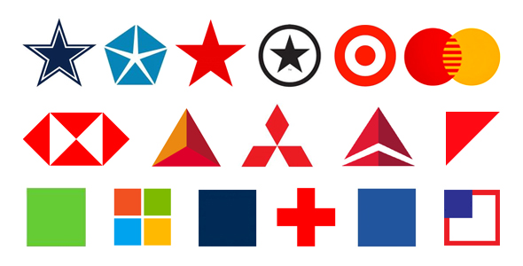

# Mockup Challenge

Today we are going to create logos!

**GOAL**: For today's lab, you will be recreating popular logos. Using the commands you have learned and other shapes that exist in p5, create one or more of the logos shown above. Create as many as you can! You can find [documentation on other shapes here](https://p5js.org/reference/#group-Shape). 

Use our new knowlege of the `triangle` and `vertex` functions to help create some of the more complex shapes. 